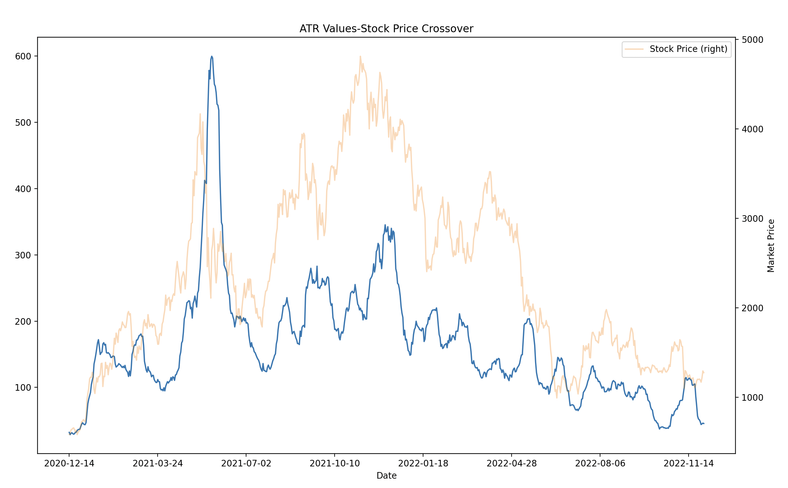

# Simple Moving Average Crossover Strategy
### Implementing buy signals using SMA Crossover and ATR(Average True Range)

(Disclaimer: The trading strategy in this article is for educational purposes only.
Decisions relating to buying/selling of stocks should be made only after research)

#### Technical Defintions:
SMA(Simple Moving Average) - A simple moving average (SMA) is a calculation 
that takes the arithmetic mean of a given set of prices over a specific number of days
(In this algorithmic strategy a 50 day SMA and a 20 day SMA are considered)

ATR(Average True Range) - The Average True Range is a technical indicator that
measures market volatility by decomposing the entire range of an asset price 
within that period. Information below demonstrates how to calculate the ATR

Moving Average Crossover - This meeting point can be used as a potential 
indicator to buy or sell. When the short term moving average crosses above 
the long term moving average, this indicates a buy signal

#### Strategy Details:
- Considering Ethereum between December 1st 2019 - December 1st 2022
- Considering a 50-day SMA and a 20-day SMA
- +5 ATR magnitude and -1 ATR magnitude as stop loss

###### ATR Values x Stock Price
Legend:  
Blue - ATR Values  
Orange - Stock Price

  
###### Stock Price X 50SMA X 20SMA X Buying_Points
Legend:  
Blue - Stock Price  
Red - 50SMA  
Green - 20SMA  
Green UP arrows - Buying_Points

#### Results
Total Returns (only buy positions) 13.78%

#### Improvements
- Incorporating shorting positions when the 20 MA falls below the 50 MA
- Using Exponential Moving Averages
- Optimizing the ATR values for each moving average

